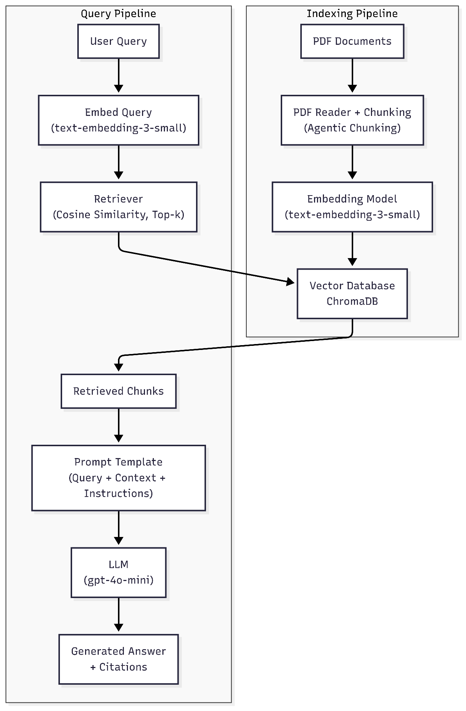

## System Architecture

The architecture of the RAG system consists of two main pipelines: **Indexing** and **Query Processing**.

In the **Indexing Pipeline**, PDF documents are loaded and split into smaller, semantically meaningful chunks using an agentic chunking strategy. Each chunk is transformed into a vector representation with OpenAI embeddings and stored in the ChromaDB vector database, which serves as the system’s knowledge base.

In the **Query Pipeline**, a user query is embedded with the same embedding model and compared against the stored vectors using cosine similarity. The retriever selects the most relevant top-k chunks, which are then combined with the user query and predefined instructions inside a structured prompt template. This prompt is sent to the LLM (gpt-4o-mini), which generates the final answer grounded in the retrieved documents. The system returns the response together with citations for transparency.

## Model Configuration

The RAG system is based on two core model components: **embedding model** and **LLM**.

- **Embedding Model**  

    In the current setup, embeddings are created automatically when documents are processed and stored in **ChromaDB**. By default, `ChromaDb()` in Agno uses the `OpenAIEmbedder()` as its embedding backend --> [Agno ChromaDB Docs](https://docs.agno.com/vectordb/chroma).  The `OpenAIEmbedder()` relies on OpenAI’s **`text-embedding-3-small`** model for generating vector representations of text --> [Agno OpenAI Embedder Docs](https://docs.agno.com/embedder/openai).

- **LLM**  
  For answer generation, the system uses *OpenAI’s GPT-4o-mini* model. It provides a balance between accuracy, cost, and performance. Compared to larger models (e.g., GPT-4), it is faster and more cost-efficient while still offering sufficient reasoning capabilities. Its large context window (128k tokens) also makes it well-suited for RAG applications.

### Token Limits
- **Context window:** GPT-4o-mini supports up to **128k tokens**, which defines the maximum size of the combined system instructions, user query, and retrieved context that can be processed at once. Selecting the number of retrieved documents (parameter *k*) is therefore critical to avoid exceeding this limit while still ensuring sufficient coverage of relevant information.  
- **Maximum output:** The model can generate up to **16,384 tokens** per response. This sets an upper bound for the length of the generated answer.

### Other Parameters
- **Top-k retrieval:** Configured to `5`. This balances completeness and efficiency by retrieving enough context without adding excessive noise.  
- **Vector database:** `ChromaDB` with cosine similarity for ranking document vectors. Stores embeddings persistently and supports efficient similarity search at query time.

